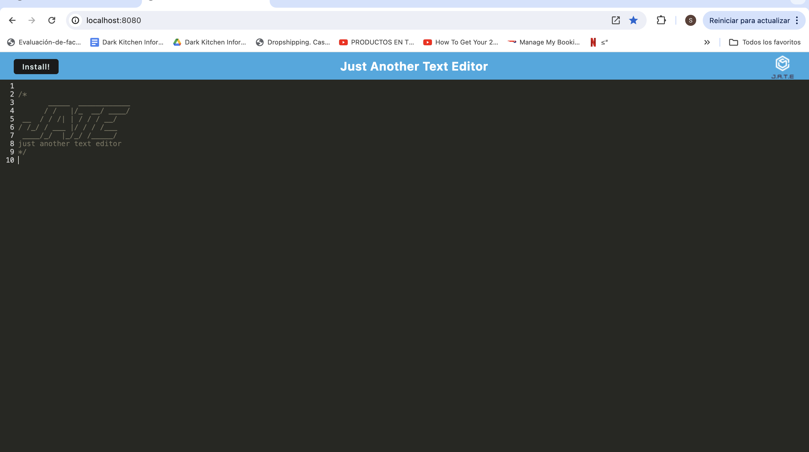

# Just Another Text Editor (J.A.T.E)

## Description
J.A.T.E is a Progressive Web Application (PWA) text editor that allows you to create, edit, and save text files. It is built with modern web technologies and can be installed to run offline as a standalone application.

## Table of Contents
- [Description](#description)
- [Installation](#installation)
- [Usage](#usage)
- [Building for Production](#building-for-production)
- [Features](#features)
- [Technologies Used](#technologies-used)
- [Contributing](#contributing)
- [License](#license)
- [Repository Link](#repository-link)
- [Deployment](#deployment)

## Installation
To install the application, follow these steps:

1. Clone the repository:
   ```bash
   git clone https://github.com/StgoWF/PWA-text-editor.git
   ```

2. Navigate to the project directory:
   ```bash
   cd text-editor-pwa
   ```

3. Install the dependencies:
   ```bash
   npm install
   ```

## Usage
To start the application in development mode, run:
```bash
npm run start:dev
```

This will start the server and the Webpack dev server. You can access the application at:
- `http://localhost:3000`
- `http://localhost:8080`

## Building for Production
To build the application for production, run:
```bash
npm run build
```

This will create a `dist` directory with the production build of the application.


## Features
- Offline support
- Syntax highlighting with CodeMirror
- Save and load text files
- Installable as a PWA

## Technologies Used
- JavaScript
- Node.js
- Express.js
- Webpack
- Babel
- CodeMirror
- IndexedDB
- Workbox

## Repository Link
The code for this application can be found at [GitHub Repository](https://github.com/StgoWF/PWA-text-editor).

## Screenshot


## Deployment
Experience the live application [here](https://pwa-text-editor-q90t.onrender.com/).

## Contributing
Contributions are welcome! Please open an issue or submit a pull request.

## License
This project is licensed under the MIT License.


## Contact
For any inquiries, please contact [stgoweinsteinf@gmail.com](mailto:stgoweinsteinf@gmail.com).

